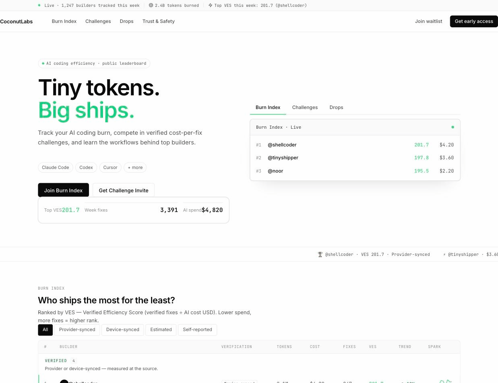

# CoconutLabs — Web

Static landing page for CoconutLabs.xyz — AI coding efficiency leaderboard,
cost-per-fix challenges, and verified workflow drops.

> **Status**: Hypothesis-validation prototype. Not a production product.

---

## Demo



*Run the collector → upload your Burn Summary → appear on the leaderboard*

---

## Setup

```bash
cd web
npm install
npm run dev
```

Open [http://localhost:3000](http://localhost:3000).

---

## Build

```bash
npm run build   # TypeScript check + production bundle
npm run start   # Serve production build
```

---

## Stack

- **Next.js 16** (App Router, TypeScript)
- **Tailwind CSS v4** (config-less, `@theme` tokens in `globals.css`)
- **React 19** (via Next.js canary)
- Fonts: Inter + JetBrains Mono via `next/font/google`

---

## Project structure

```
web/
├── app/
│   ├── layout.tsx        # Fonts + metadata
│   ├── page.tsx          # Thin server component → LandingApp
│   └── globals.css       # Design tokens + ported skin CSS
├── components/
│   ├── LandingApp.tsx    # 'use client' shell (toast, modal state)
│   ├── Nav.tsx
│   ├── StatusBar.tsx
│   ├── Hero.tsx          # Includes ProductShot, HeroSecondaryCard
│   ├── Ticker.tsx
│   ├── BurnIndexSection.tsx
│   ├── ChallengeSection.tsx  # Includes CodePanel, Stat
│   ├── BuildersSection.tsx   # Includes ActivityFeed
│   ├── DropsSection.tsx
│   ├── TrustSection.tsx
│   ├── FinalCTA.tsx
│   ├── Footer.tsx
│   ├── Toast.tsx
│   ├── Sparkline.tsx
│   ├── primitives/       # Icon, Button, Badge, VerifBadge, Avatar, Trend
│   └── forms/
│       ├── JoinBurnIndexForm.tsx     # Placeholder, local state only
│       └── ChallengeInviteForm.tsx   # Placeholder, local state only
├── lib/
│   └── data.ts           # Types + static data + sparkFor()
├── docs/
│   └── usage-poc.md      # Track B manual guide
└── tools/usage-poc/
    ├── env-info.sh
    ├── discover-logs.sh
    ├── search-marker.sh
    ├── inspect-fields.sh
    ├── estimate_cost.py     # Token-count → USD cost estimator
    └── model-pricing.json   # Model pricing table (USD / 1M tokens)
```

---

## Track B — CLI usage PoC

See `docs/usage-poc.md` for the step-by-step guide to validate the
device-side collection hypothesis.

```bash
cd tools/usage-poc
chmod +x *.sh
./env-info.sh
./discover-logs.sh
./search-marker.sh
./inspect-fields.sh <path>
```

### Cost estimation

`estimate_cost.py` converts token counts to estimated USD cost (the
"Estimated" verification tier) using `model-pricing.json`.

```bash
# Single session log
./estimate_cost.py <log-file> [--tool claude|codex] [--json]

# Aggregate every local session (~/.claude/projects, ~/.codex/sessions)
./estimate_cost.py --all [--json]
```

`--all` globs all standard log directories, sums token usage per
`(tool, model)`, and prints per-model rows plus a grand total. Empty or
unparseable files are skipped and counted. Add `--json` for machine output.

**Security**: scripts output file names, paths, and field names only.
`estimate_cost.py` reads only whitelisted numeric token keys and emits
aggregates only — never prompt, response, or source-code content.

---

## Testing

### Unit tests (vitest)

```bash
npm test
```

### E2E tests (Playwright — Chromium)

> **Before running e2e:** stop any existing `npm run dev` instance on port 3000/3001.
> Playwright starts its own dev server on **port 3002** with `BURN_STORE=memory`
> for isolation. A live dev server on an adjacent port can shadow the baseURL and
> cause the wrong app to load.

```bash
npx playwright test          # headless
npx playwright test --ui     # interactive UI mode
```

E2E tests live in `e2e/`. They stub `showDirectoryPicker` and patch the
handles IDB to bypass `structuredClone` constraints on fake FSA handles.

---

## What this prototype does NOT include

- Real authentication or account system
- Payment / marketplace
- Actual CLI collector or API integration
- Executable workflow installation
- Any server-side data storage

Forms submit locally and trigger a toast confirmation only.
