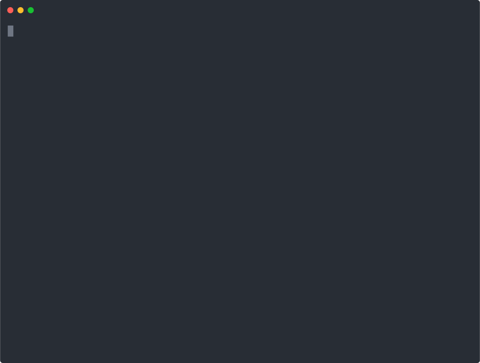

# coconut-collector

CoconutLabs Burn Summary CLI — reads local Claude Code / Codex session logs and emits a cost summary for [coconutlabs.xyz](https://coconutlabs.xyz).



**Security**: only token counts, timestamps, and salted project hashes are read. Prompts, source code, and file contents are never read or uploaded. See `coconutlabs-verification-model.md`.

## Install

```bash
pip install coconut-collector
```

## Run

```bash
# Scan standard log paths (~/.claude, ~/.codex) — this week
coconut-collector

# Explicit home directory (same result for most users)
coconut-collector ~/

# All-time aggregate
coconut-collector --period all

# Output as JSON for upload
coconut-collector --json > burn-summary.json
```

Then upload `burn-summary.json` at [coconutlabs.xyz](https://coconutlabs.xyz) to appear on the leaderboard.

## Options

```
usage: coconut-collector [PATH] [--period {day,week,month,year,all}] [--json]

positional arguments:
  PATH        Root directory to scan for logs (default: standard install paths)

options:
  --period    Calendar window to aggregate (default: week)
  --json      Print envelope JSON instead of a human table
  --help      Show this message and exit
```
